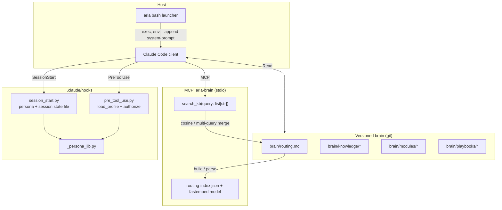
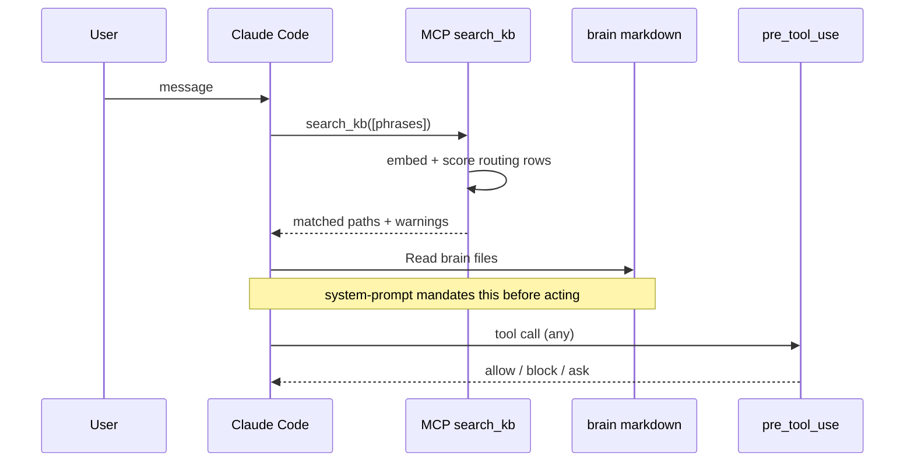

# ARIA (`arcadia-aria`) — Technical System Design

**Audience:** Software engineers and AI/ML engineers who implement, extend, or operate ARIA.  
**Scope:** Architecture, runtime behavior, data structures, and code touchpoints. Excludes team process, release management, and non-technical workflow.

**Related reads:** [`ENGINEER-LEARNING-PATH.md`](./ENGINEER-LEARNING-PATH.md) (ordered path from first clone to deep dives), `README.md` (install, AWS profiles, credentials), `system-prompt.md` (model contract), `brain/routing.md` (semantic routing source of truth), `docs/SKILL-DAG-BOUNDARY-SPEC.md` (SKILL vs automation DAG), `docs/semantic-routing-architecture.html` (routing visualization).

---

## 1. Purpose and use case (technical)

**ARIA** is Arcadia’s **Claude Code–based assistant** with a **versioned local knowledge base** (`brain/`), **semantic retrieval** over a routing table (`search_kb` MCP tool), and **layered guardrails** (Claude `settings.json` + persona-aware hooks).

| Goal | Mechanism |
|------|-----------|
| Domain-grounded answers | `brain/knowledge/`, `brain/modules/`, `system-prompt.md` (mandatory `search_kb` first) |
| Spec-driven and operational workflows | Lazy-loaded `brain/modules/*.md`, `brain/playbooks/`, `.claude/skills/*/SKILL.md` |
| Safe tool use | Static bash/tool deny rules + **dynamic** authorization in `pre_tool_use.py` from **session file–bound** persona |
| Repeatable org procedures | Markdown + tests (e.g. WFA XML builders) co-located with skills |

**Non-goals (enforced in prompt + settings):** destructive or prod-unapproved operations (e.g. `dbt` against prod targets, broad AWS mutating CLI), bulk repo cloning, improvising infrastructure identifiers without reading cards (see `system-prompt.md`).

---

## 2. Repository map (what lives where)

| Path | Role |
|------|------|
| `aria` | Bash launcher: `ARIA_ROOT`, SSO/secrets, LiteLLM token, symlinks `~/.claude/skills` and `commands`, spawns `claude` with `--append-system-prompt`, `--settings`, MCP config. |
| `install.sh` | Installs CLI deps, `uv` venv at `~/.aria/.venv`, downloads embedding model, runs `brain/mcp/build_routing_index.py` → `~/.aria/.cache/routing-index.json`. |
| `system-prompt.md` | **Primary behavioral contract** for the model: `search_kb` gate, `gh` safety, S3 write gate, subagent pre-load rules. |
| `brain/routing.md` | **Machine-parsed** markdown tables: trigger phrases → `brain/...` paths. Drives embedding index. |
| `brain/mcp/mcp_server.py` | **FastMCP** stdio server: tool `search_kb` (list of query phrases). |
| `brain/mcp/routing_core.py` | Shared: parse `routing.md`, build/load index, `sentence-transformers/all-MiniLM-L6-v2` via **fastembed**, `multi_search` / `format_results`. |
| `brain/mcp/build_routing_index.py` | Offline index builder (also invoked by `install.sh`). |
| `.cache/routing-index.json` | In-repo (dev) or under `~/.aria/.cache` (installer); embedding vectors for routing rows. **Env:** `ARIA_INDEX_REBUILD` (default rebuild when `routing.md` changes in dev). |
| `.claude/settings.json` | Tool allow list, large **bash deny** surface, `hooks` → `SessionStart`, `PreToolUse`, `PostToolUse`, `statusLine`. |
| `.claude/mcp.json` | Registers `aria-brain` → `python3 brain/mcp/mcp_server.py` (stdio, 120s timeout). |
| `.claude/hooks/` | `session_start.py` (identity, persona, env), `pre_tool_use.py` (authorization), `post_tool_use.py`, `post-brain-edit.py`, shell helpers. |
| `.claude/hooks/_persona_lib.py` | Registry + profile loading, SSO → persona, `authorize()` chain, per-session state under `~/.aria/state/`. |
| `personas/persona-registry.yaml` | Maps IAM Identity Center permission set names → persona tier; defines environment sets per tier. |
| `personas/profiles/*.yaml` | Per-persona: bash deny patterns, capabilities, rate limits, tool posture. |
| `brain/knowledge/**` | Domain “cards” (hundreds of markdown files). |
| `brain/modules/**` | Workflow modules (SDD, Jira, Confluence, dbt, AWS, Airflow, …). |
| `brain/scripts/**` | **Executable helpers** (e.g. `atlassian.sh`, `mssql_query.py`, `sibling_finder.py`); some referenced from routing. |
| `brain/playbooks/**` | Operational playbooks (reprocessing, refresh, OpsBot-related flows). |
| `.claude/skills/**` | **Cursor/Claude Skill** packages (`SKILL.md` + assets): deep workflows (WFA, Assess, console-ops, k8s read-only, …). |
| `.claude/commands/**` | Slash-style command docs for Claude Code. |
| `config/mirror_constants.yaml` | Pairs of symbol names; `brain/scripts/validate_mirror_constants.py` keeps literals in sync with `aria-bot` (no shared package). |
| `tests/**` | pytest: routing index, hooks/persona, WFA XML/SQL builders, sibling resolution, token fetch, mirror validator, etc. |
| `scripts/**` | Utilities: LiteLLM reports, eval runners, NiFi, Slack, SSO refresh, … |
| `specs/**` | Design artifacts (e.g. knowledge curation pipeline, tool lockdown). |
| `tools/claims-data-guide/**` | Schema summaries / report generation (domain-specific tool). |
| `secrets.env.tpl` | 1Password reference template (`op://...`) — no secrets in git. |
| `pyproject.toml` | Ruff + pytest config (no `project` deps in tree; Python deps come from `install.sh` / `uv` in `~/.aria/.venv`). |

---

## 3. High-level runtime architecture

**Data plane:** Inference and tools run in **Claude Code** on the engineer’s machine. **No** remote “brain” server for file content: the model **reads** `brain/` from disk. The only **networked retrieval** in the default stack is: **(1)** LiteLLM proxy for the model, **(2)** optional `WebFetch` / `Bash` as permitted, **(3)** org APIs the user already authorized (Jira, AWS, etc.).

**Control plane:** **SessionStart** writes authoritative `ARIA_PERSONA` (and related fields) to a **per-session JSON file** keyed by `session_id`. **PreToolUse** **does not** trust `ARIA_PERSONA` from the environment (user-settable); it re-reads session state so persona bypass is harder.

---

## 4. Launcher (`aria`) — technical responsibilities

Resolved from the script’s real path:

- **Working directory:** `--home` or cwd for Claude.
- **Inference auth:** `aws sts` identity → per-user **LiteLLM** key via **aria-bot** `get-litellm-token` (or `ARIABOT_API_KEY` for headless), sets `ANTHROPIC_AUTH_TOKEN` + `ANTHROPIC_BASE_URL`, unsets `ANTHROPIC_API_KEY` to avoid dual-auth ambiguity.
- **Claude flags:** typically `--add-dir "$ARIA_ROOT"`, system prompt = prefix + `system-prompt.md`, `--settings` `.claude/settings.json`, MCP config.
- **Symlinks:** `~/.claude/skills` and `~/.claude/commands` point into this repo so skills ship with the clone.
- **1Password / legacy secrets:** `secrets.env.tpl` pattern; optional `aria --setup-secrets` (see `README.md`).

**AI engineer note:** `aria` is the **composition root** for all paths (`ARIA_ROOT`), tool policies, and hook commands that reference `${ARIA_ROOT}` in `settings.json`.

---

## 5. Semantic routing (`search_kb`)

### 5.1 Source: `brain/routing.md`

- **Structured as markdown tables** under headings like `## Workflow Routing` and `## Knowledge Triggers`.
- Rows list **triggers** (left column) and **actions** (right column) with backticked `brain/...` paths.
- `routing_core.parse_routing_md` skips non-routing sections (e.g. anti-patterns) and strips markdown for embedding text.
- **Query API:** the MCP tool **requires** `query` as a **list of short phrases**; each phrase is embedded and results merged (best score per entry wins) — this reduces single-vector ambiguity for multi-intent user messages.

### 5.2 Index and model

- **Model:** `sentence-transformers/all-MiniLM-L6-v2` loaded through **fastembed** (`TextEmbedding`).
- **Index file:** JSON on disk; built by `build_routing_index.py` and loaded by `mcp_server._get_index()`.
- **Hot reload:** if `ARIA_INDEX_REBUILD` is true (default), changes to `routing.md` mtime trigger rebuild on next `search_kb` call; optional persist to `.cache/routing-index.json`.
- **Container / baked index:** set `ARIA_INDEX_REBUILD=false` to use only a pre-baked index (no model download at runtime).

### 5.3 Contract with the model

`system-prompt.md` treats **`search_kb` as a hard gate** before almost every user turn: the model is instructed to **not** use other tools first (except trivial confirmations). That couples **RAG-style retrieval** to **governance** (org paths are discovered before improvisation).

---

## 6. Guardrails: two layers

### 6.1 Static: `.claude/settings.json`

- **allow:** `Read`, `Edit`, `Write`, `Glob`, `Grep`, `Task`, `Skill`, `WebFetch`, `Bash`, `mcp__aria-brain__search_kb`.
- **deny:** Pattern-based **bash** blocks (git force-push, `rm -rf`, many `aws * delete/modify*`, `dbt` prod targets, SQL drops, etc.).
- **hooks:** `PreToolUse` runs `rtk-rewrite.sh` (Bash) then `pre_tool_use.py` (all tools); `PostToolUse` includes brain edit hooks, `pr-review.sh` on Bash, `post_tool_use.py` global.

### 6.2 Dynamic: personas + `authorize()`

- **Registry:** `personas/persona-registry.yaml` maps SSO **permission set** name (in assumed-role ARN) → **persona** (e.g. `engineer`, `viewer`) and which **environments** (`dev`, `uat`, `staging`, `production`) are valid for that tier.
- **Profile:** `personas/profiles/<persona>.yaml` — e.g. `engineer` adds **bash_deny_patterns** (regex) such as `git push --force`, `terraform destroy`, and sets **capabilities** (e.g. `knowledge-base-write`).
- **Session start:** `session_start.py` resolves identity (SSO, `ARIA_DEV_MODE` with cap, or `ARIA_SERVICE_ACCOUNT` for automated agents), then writes **session state** for `session_id`.
- **Pre-tool:** `pre_tool_use.py` loads that state, `load_profile(persona)`, and runs **authorization** (block / ask / allow) with **fail-closed** behavior in production on missing state or library errors (see file header comments).
- **Implementation surface:** ~1200+ lines in `_persona_lib.py` (atomic writes, file locks, rate limits, environment detection).

---

## 7. Content layers: modules, knowledge, skills, commands

| Layer | Location | Nature |
|-------|----------|--------|
| **Knowledge cards** | `brain/knowledge/<domain>/*.md` | Fine-grained facts, URLs, query patterns, naming conventions. |
| **Modules** | `brain/modules/*.md` | Procedure templates: “load these cards, then run these steps.” |
| **Routing** | `brain/routing.md` | Binds user-language triggers to modules + cards (used by `search_kb`). |
| **Playbooks** | `brain/playbooks/` | Longer operational runbooks. |
| **Skills** | `.claude/skills/<name>/SKILL.md` | Packaged SOPs with optional YAML schemas (e.g. `refinepr/`), used when the Task/Skill path is engaged. |
| **Commands** | `.claude/commands/*.md` | User-invoked documentation for Claude Code. |

**SKILL ⟷ DAG boundary:** For automations (WFA, Assess, …), `docs/SKILL-DAG-BOUNDARY-SPEC.md` defines a **content vs actions** split: the SKILL produces artifacts and a tightly scoped Jira handoff; external orchestration (git push, CI, etc.) is conceptually “DAG” work. This keeps skills **testable** and limits side effects.

---

## 8. Notable subsystems in code

### 8.1 WFA (connector workflow) XML/SQL

- **Skills:** `.claude/skills/cm-wfa-resolution/`, `assess-config-resolution/`, related tier templates.
- **Code:** Python under `brain/scripts` (WFA change application) is exercised by **`tests/test_wfa_*.py`**: round-trip XML, CDATA, full-replace validation, config path resolution, blast-radius gates, SQL commit message builder, `copy_config_from_sibling` behavior.
- **Purpose (technical):** Safe, deterministic transforms on customer **workflow XML** and associated SQL, with **canonicalization** checks to prevent partial edits from slipping through.

### 8.2 Sibling / Jira resolution

- **`brain/scripts/sibling_finder.py`:** Resolves “sibling” Jira / deployment relationships for tickets; used in automated classification flows.
- **`config/mirror_constants.yaml` + `validate_mirror_constants.py`:** Keep **Jira state sets and link types** bit-identical to definitions in `aria-bot` to avoid cross-repo behavioral drift.

### 8.3 `tools/claims-data-guide/`

- Schema summaries (`schema-summary.json`, `entity_meta.json`) and `generate_verified_report.py` — a **self-contained** analytical tool; useful when extending data-documentation skills.

### 8.4 Scripts and observability

- `scripts/fetch-litellm-token.py`, `litellm-usage-report.py`, `litellm-correct-costs.py` — **LiteLLM** and cost observability.
- `scripts/aria-sso-refresh.sh` / `.py` — **AWS SSO** refresh (referenced from `settings.json` as `awsAuthRefresh`).
- `scripts/run-evals.sh` — evaluation harness entry (see script for expectations).

---

## 9. Testing (what the suite protects)

| Area | Test files (examples) |
|------|-------------------------|
| Routing index | `test_build_routing_index.py` |
| Session / persona | `test_session_start.py`, `test_persona_lib.py` |
| LiteLLM token path | `test_fetch_litellm_token.py` |
| WFA XML / SQL | `test_wfa_xml_builder*.py`, `test_wfa_sql_builder.py`, `test_target_filter_resolver.py`, `test_copy_config_from_sibling.py` |
| Sibling / mirror | `test_sibling_finder.py`, `test_validate_mirror_constants.py` |
| Config copy from sibling | `test_copy_config_from_sibling.py` |

Run: `pytest` (see `pyproject.toml` `testpaths`).

---

## 10. Diagram: request path (simplified)

---

## 11. Key files for “under the hood” debugging

| Symptom | Check |
|--------|--------|
| No hits / stale routing | `brain/routing.md`, `ARIA_INDEX_REBUILD`, `.cache` / `~/.aria/.cache/routing-index.json` mtime |
| `search_kb` string vs list | Tool schema expects **list**; `routing_core` accepts legacy single string and wraps |
| Guardrail too strict | `personas/profiles/<you>.yaml`, `session state` under `~/.aria/state/`, stderr from `pre_tool_use.py` |
| Wrong tier | `persona-registry.yaml`, SSO role ↔ permission set mapping, `session_start` logs |
| Claude not seeing skills | Symlinks in `~/.claude/` → `arcadia-aria/.claude/` (re-run `install.sh` or check `aria` script) |
| Auth / model errors | `README` LiteLLM + VPN, token TTL, `ANTHROPIC_*` env from launcher |

---

## 12. AI & engineering concept index

**Retrieval & grounding:** RAG pattern (local), semantic search, embedding model (MiniLM), query decomposition (multi-phrase), cosine similarity, thresholding, markdown table parsing as structured IR.

**Agent stack:** Claude Code, system prompt as policy, tool allow/deny lists, subagent delegation, preloaded context to avoid duplicate retrieval.

**MCP:** Model Context Protocol, stdio transport, FastMCP, `search_kb` tool surface, timeout configuration.

**Identity & authorization:** IAM Identity Center, SSO permission sets, assumed-role ARN parsing, per-session state file, fail-closed vs fail-open, YAML personas, regex bash policies, capability flags, rate / bulk limits.

**Safety & alignment:** Tool-order constraints (`search_kb` first), destructive command blocking, S3 write confirmation pattern, `gh` CLI JSON/`--jq` rules (per `system-prompt.md`).

**Knowledge engineering:** knowledge cards, routing tables, playbooks, skills, SKILL vs DAG separation, deterministic vs side-effecting automation.

**Software engineering:** pytest, XML canonicalization / full-replace validation, CDATA preservation, Jira constant mirroring across repos, `uv`/venv, shell hooks composition.

**Data & integration (surface area):** LiteLLM proxy, AWS (Secrets Manager, EKS, Athena, …), 1Password CLI, Jira/Confluence curl patterns, QDW/MSSQL scripts, Snowflake connection pattern (per README) — *always read cards before constructing connection strings*.

**Observability:** cost scripts, stream watchdog env vars (see `README` for `CLAUDE_STREAM_IDLE_TIMEOUT_MS`).
